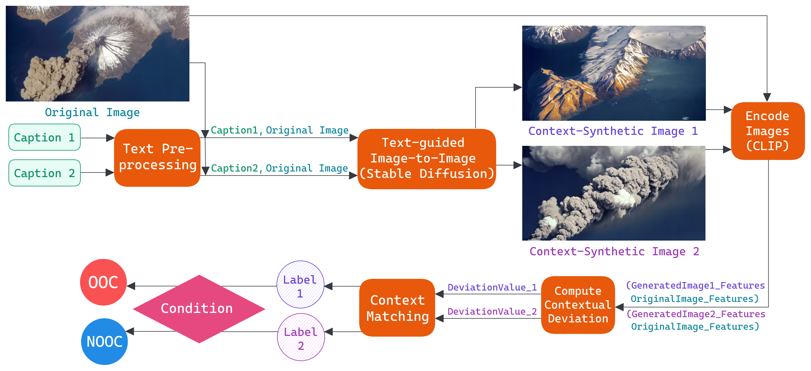
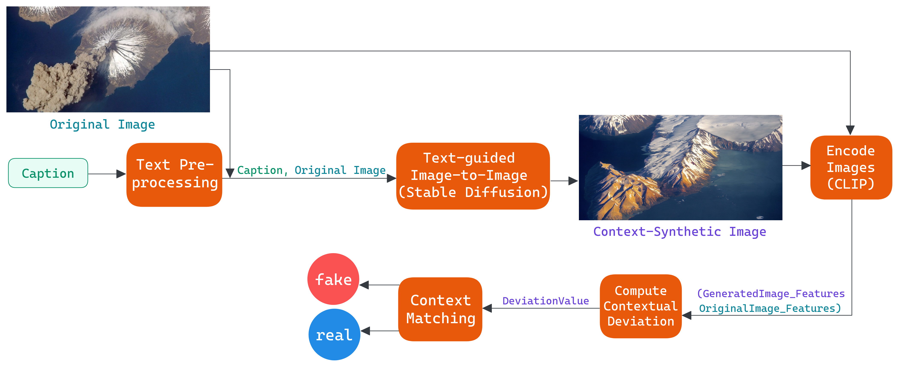

## ACM ICMR 2024 - The 14th International Conference on Multimedia Retrieval 
---
### Description 
This code represents a Text-Guided Generative-based Approach developed for the [ACM ICMR 2024 Grand Challenge on Detecting Cheapfakes](https://detecting-cheapfakes.github.io/icmr-2024.html). It is showcased in both Task 1 and Task 2.

Our Paper: [Link]()

#### Overall Pipeline

**Task 1:** Detect miscontextualization in (Image, Caption1, Caption2) triplets. If captions describe the same objects but different events, it's out-of-context (OOC). If they describe the same event regardless of objects, it's not-out-of-context (NOOC).




**Task 2:** Determine whether a given (Image,Caption) pair is genuine (real) or falsely generated (fake).



### Generated dataset

In this work, we create a new dataset tailored to our specific requirements, leveraging the [COSMOS](https://github.com/shivangi-aneja/COSMOS) dataset as a foundation.

You can find our training dataset in folder [generated_dataset](generated_dataset). 
 - The [dataset.txt](generated_dataset/sd_dataset.txt) file contains links to images stored on Google Drive, along with their corresponding annotations in the [sd_pairs.json](generated_dataset/sd_pairs.json) file. The annotation file includes captions and the relative path to each image.

### Evaluation Guide

-  Access to the [icmr2024_challenge.ipynb](icmr2024_challenge.ipynb) notebook. If necessary, modify the input folder path in the notebook according to your setup.
  
**Note:** The input folder path should have the following structure:

    INPUT_FOLDER
    ├── test.json
    ├── public_test_mmsys
    │ ├── 0.jpg
    │ ├── 1.png
    │ ├── 2.jpg
    │ ├── ...jpg

- Execute the first four sections of the notebook to set up the environment and define necessary functions.

 
- In the final section, execute the cells corresponding to the task you wish to experiment.

### Experimental Results:

#### Dataset
We utilize the `public_test_set`, consisting of 1000 samples, provided by the challenge organizer for Task 1.

##### Effectiveness
(1) Accuracy: *79.4%* 
(2) Average Precision: *update later*
(3) F1-Score: *update later*

##### Efficiency
(1) Number of Trainable Parameters: *278811651*
(2) GLOPS: *update later*
(3) Model Size (MBs): *1063.58*

**Note:** This experiment run on Google Colab Pro with A100 GPU.

---
<!-- ### Citation
If you utilize the code in your research or reference our paper, kindly include the following citation:

```
@inproceedings{icmr2024tega,
  title={TeGA: A Text-Guided Generative-based Approach in Cheapfake Detection},
  author={Anh-Thu Le and Minh-Dat Nguyen and Anh-Duy Tran and Duc-Tien Dang-Nguyen and Minh-Son Dao},
  booktitle={Proceedings of the 14th International Conference on Multimedia Retrieval (ICMR)},
  year={2024},
  pages={},
  organization={ACM}
}
``` -->
